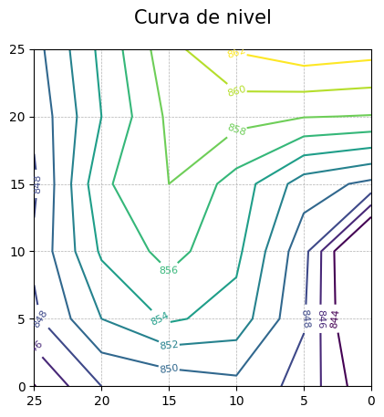

# Curvas de nivel en python

Este script fue usado para trazar de forma automática las curvas de nivel de un terreno (2D y 3D). Es algo viejo, pero a alguien le puede servir para no hacerlo de forma manual.

### Datos de entrada

La primera fila contiene las coordenadas X, la primera columna contiene las coordenadas Y, y el resto son las alturas topográficas.

|      |     1 |     2 |     3 |     4 |     5 |     6 |
|------|------:|------:|------:|------:|------:|------:|
| NaN  |    25 |    20 |    15 |    10 |     5 |     0 |
| 25   | 849.2 | 854.5 | 859.3 | 862.2 | 863.3 | 862.8 |
| 20   | 848.5 | 854.0 | 858.4 | 858.7 | 858.1 | 857.9 |
| 15   | 847.6 | 855.6 | 858.0 | 855.2 | 851.0 | 849.5 |
| 10   | 848.4 | 854.3 | 856.7 | 854.5 | 848.7 | 838.3 |

### Resultado

